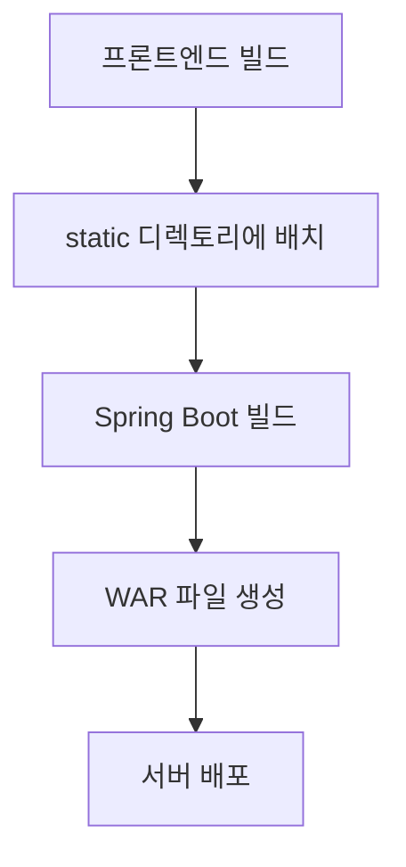

## 📋 프로젝트 빌드 및 절차 변경사항 정리

## 🔧 **전체 빌드 프로세스**


---

## 🚀 **단계별 빌드 프로세스**

### **1단계: 프론트엔드 빌드**
  
```bash
# 1. 프로젝트 루트에서 Spring Boot용 빌드 실행
cd /path/to/home/amano-dx-frontend
./build-for-spring.sh

# 빌드 결과
# ✅ apps/dx-service/out/ - 정적 파일들
# ✅ apps/dx-service/dx-service-build.tar.gz - 배포용 압축 파일이 생성됨
```

#### **' 빌드 스크립트 ' 설명**
- `build-for-spring.sh`: Spring Boot 전용 빌드 스크립트
- `build-production.sh`: 전체 워크스페이스 빌드용 (검증용으로 현재 사용할 필요 없음)

### **2단계: 프론트엔드 빌드 파일 복사**
"dx-service-build.tar.gz" 파일을 프론트엔드 프로젝트에서 백엔드 프로젝트로 복사
```bash
cp /path/to/home/amano-dx-frontend/apps/dx-service/dx-service-build.tar.gz /path/to/home/amano-dx-backend/DxService/.
```

### **3단계: 프론트엔드 파일 배치**
- "dx-service-build.tar.gz" 를 압축해제하여 "static" 폴더 아래에 파일들을 배치.
- 배치전에 static 하단에 '파일/폴더'들을 삭제.
```bash
cd /path/to/home/amano-dx-backend/DxService

rm -rf src/main/resources/static/*

tar -xzf dx-service-build.tar.gz -C src/main/resources/static/
```

### **4단계: 통합 빌드 실행**
```bash
cd /path/to/home/amano-dx-backend
chmod +x build.sh
./build.sh
```

### **5단계: 빌드 결과 확인**
- 생성 파일: DxService-0.0.1-SNAPSHOT.war
- 포함 내용: 백엔드 + 프론트엔드 + 의존성 라이브러리


### **6단계: 서비스 실행**
- 'DxService-0.0.1-SNAPSHOT.war' 파일을 이용하여 서비스 실행
```bash
java -jar DxService-0.0.1-SNAPSHOT.war
```
---
<!-- pagebreak -->

## **🔧 Frontend 주요 변경사항**

### **1. Next.js 정적 빌드 설정**
**파일**: next.config.js
```javascript
// Spring Boot 배포를 위한 설정
output: 'export',           // 정적 파일로 export
trailingSlash: true,        // URL 뒤에 / 추가
distDir: 'out',            // 빌드 출력 디렉토리
images: { unoptimized: true }, // 이미지 최적화 비활성화
eslint: { ignoreDuringBuilds: true },    // 빌드 시 ESLint 무시
typescript: { ignoreBuildErrors: true }, // 빌드 시 TypeScript 오류 무시
```

### **2. 환경 변수 통합**
**새 파일**: .env.production
```bash
# 모든 API를 8087 포트로 통합
NEXT_PUBLIC_BACKEND_URL=http://localhost:8087
NEXT_PUBLIC_API_BASE_URL=http://localhost:8087
NEXT_PUBLIC_AUTH_API_BASE_URL=http://localhost:8087
# ... 기타 모든 API 엔드포인트
```

### **3. 정적 빌드 호환성**
- **API 라우트 제거**: `src/app/api/` 폴더 완전 삭제 (정적 export에서 사용 불가)
- **동적 페이지 수정**: `/line/prd` 페이지를 정적 페이지로 변환
- **공유 라이브러리**: import 경로 수정 (`.js` → `.ts`)

---
<!-- pagebreak -->

## 🔧 **Backend 주요 변경사항**

### **1. 프론트엔드 통합 설정**
- **프론트엔드 파일 위치**: static
- **Next.js 빌드 파일**: `_next/`, 페이지 파일들, 정적 자산들 포함
- **WebConfig.java 신규 생성**: SPA 라우팅 지원을 위한 설정

### **2. Spring Boot 설정 수정** (application.yml)
```yaml
# 프로덕션 환경 정적 리소스 설정 추가
web:
  resources:
    static-locations: classpath:/static/
    add-mappings: true
mvc:
  static-path-pattern: /**

# CORS 설정 추가 (프론트엔드 API 호출 지원)
management:
  endpoints:
    web:
      cors:
        allowed-origins: "*"
        allowed-methods: GET,POST,PUT,DELETE,OPTIONS
        allowed-headers: "*"
```

### **3. .gitignore 업데이트**
```gitignore
# Next.js 빌드 파일 제외
DxService/src/main/resources/static/_next/
DxService/src/main/resources/static/
```

### **4. WebConfig.java 신규 생성**
- **SPA 라우팅 지원**: 존재하지 않는 경로 요청 시 `index.html` 반환
- **정적 파일 캐싱**: 3600초 캐시 설정
- **리소스 핸들러**: `/**` 패턴으로 모든 요청 처리
---
<center><b># END #</b></center>
